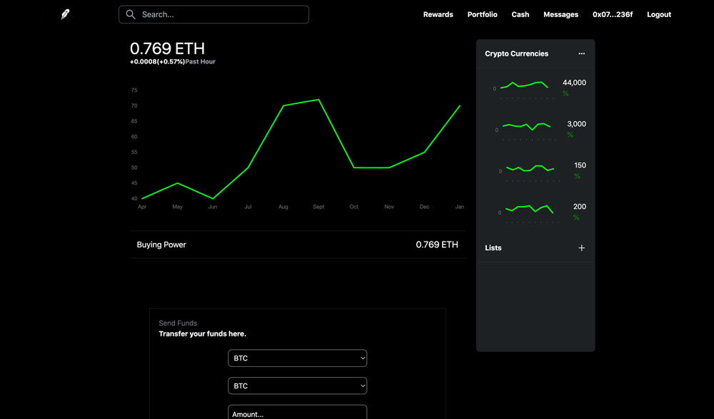

# ROBINHOOD EXCHANGE CLONE APP

The app simulates the real life robinhood app using the Rinkeby Testnet. 
Created BTC, DOGE, SOLANA, AND USDC tokens using Solidity. From our app you can 
purchase or sell these tokens.

For testing purposes you can add the tokens to your Rinkeby Testnet on your metamask

```
Bitcoin Contract Address => 0xb6c16Bf054A97b27Ad601644f231FD61A65E3dc6
Dogecoin Contract Address => 0xA94fAC6DA1AB1f550005069c0Ceadf031badf60a
Solana Contract Address => 0xE5EDf8AA146037C421664922A5cb29D68a362101
USDC Contract Address => 0x2A6FdFF843353fe1241EAc9308e91Ac22179279a
```


[Live](https://robinhood-clone-omega.vercel.app/)



## Getting Started

To get a local copy up and running follow these simple example steps.

### Prerequisites

Make sure Node.js is running on your local machine

### Setup

~~~bash
$ git clone git@github.com:acushlakoncept/robinhood-clone.git
$ cd robinhood-clone
~~~

Install modules:

```
yarn add 
```

### Usage

Start server with:

```
  yarn dev
```

# Authors

👤 **Uduak Essien**

- Github: [@acushlakoncept](https://github.com/acushlakoncept/)
- Twitter: [@acushlakoncept](https://twitter.com/acushlakoncept)
- Linkedin: [acushlakoncept](https://www.linkedin.com/in/acushlakoncept/)

## 🤝 Contributing

Contributions, issues and feature requests are welcome!

Feel free to check the [issues page](issues/).

## Show your support

Give a ⭐️ if you like this project!

## Acknowledgments
- [CleverProgrammer](/#)